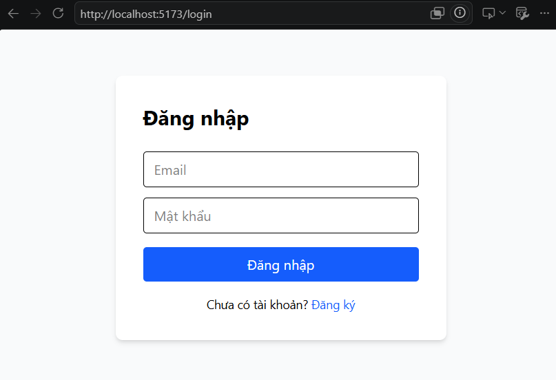
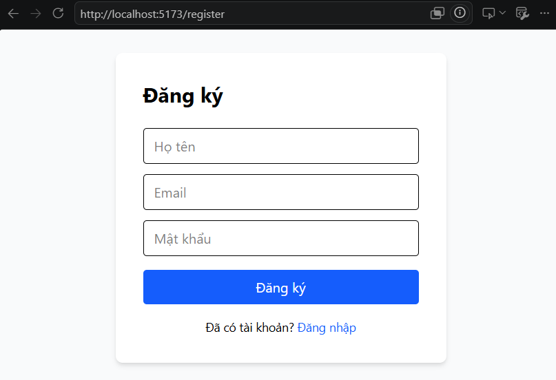
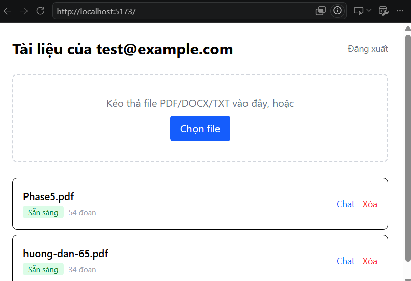
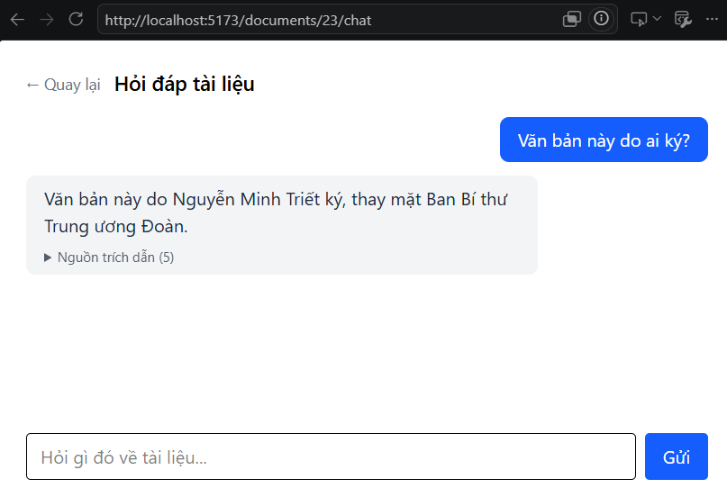

# AI Document Q&A

Hệ thống cho phép user upload tài liệu (PDF/DOCX/TXT), sau đó "chat" hỏi đáp dựa trên nội dung tài liệu đó (RAG — Retrieval Augmented Generation), có trích dẫn nguồn.

## Demo trực tuyến 
Hiện không khả dụng. <*Coming soon...*>

## Demo giao diện

| Đăng nhập                            | Đăng ký                                    |
| ------------------------------------ | ------------------------------------------ |
|  |  |

| Dashboard                                 | Chat hỏi đáp                       |
| ----------------------------------------- | ---------------------------------- |
|  |  |

## Kiến trúc

Xem chi tiết tại [docs/architecture.md](docs/architecture.md).

Tổng quan: React (Vite) frontend + FastAPI backend + MySQL (dữ liệu quan hệ) + ChromaDB (vector DB, semantic search) + Gemini API (embedding + LLM cho RAG, hỗ trợ streaming). Đóng gói bằng Docker, deploy backend lên Railway, frontend lên Vercel.

## Tiến độ

- [x] **Giai đoạn 0** — Khởi tạo repo
- [x] **Giai đoạn 1** — Backend nền tảng: Auth (JWT) + CRUD document metadata
- [x] **Giai đoạn 2** — Upload file, extract text, chunking
- [x] **Giai đoạn 3** — Embedding & Vector DB
- [x] **Giai đoạn 4** — RAG pipeline hoàn chỉnh
- [x] **Giai đoạn 5** — Frontend
- [x] **Giai đoạn 6** — Nâng cấp trải nghiệm (streaming, rate limit, error handling)
- [x] **Giai đoạn 7** — Đóng gói & Deploy

## Tech stack

- **Frontend:** React (Vite) + TailwindCSS + React Router + axios + fetch streaming (SSE)
- **Backend:** FastAPI + Pydantic
- **ORM:** SQLAlchemy 2.0 + Alembic (migration)
- **Database:** MySQL 8
- **Auth:** JWT (python-jose) + bcrypt (passlib)
- **Xử lý file:** pdfplumber (PDF), python-docx (DOCX)
- **Embedding:** Gemini API (`gemini-embedding-001`, 768 chiều)
- **Vector DB:** ChromaDB (local, persistent, 1 collection/document)
- **LLM (sinh câu trả lời):** Gemini API (`gemini-2.5-flash`), hỗ trợ streaming
- **Rate limiting:** slowapi (giới hạn theo IP)
- **Đóng gói:** Docker (multi-stage build cho frontend), Docker Compose
- **Hạ tầng:** Railway (backend + MySQL), Vercel (frontend)

## Hướng dẫn chạy local

### Cách 1 — Docker Compose (khuyến nghị, gần giống production nhất)

**Yêu cầu:** Docker + Docker Compose, API key Gemini (miễn phí, lấy tại [aistudio.google.com/apikey](https://aistudio.google.com/apikey)).

1. Clone repo:
```bash
   git clone <repo-url>
   cd AI-Document-QnA
```

2. Tạo file `.env` ở thư mục gốc:
```bash
   cp .env.example .env
   # điền JWT_SECRET_KEY, GEMINI_API_KEY và các biến MySQL
```

3. Chạy toàn bộ hệ thống (MySQL + backend + frontend) bằng 1 lệnh:
```bash
   docker-compose up --build
```

4. Truy cập:
   - Frontend: http://localhost:5173
   - Backend Swagger UI: http://localhost:8000/docs

### Cách 2 — Chạy thủ công từng phần (phù hợp khi đang phát triển)

**Yêu cầu:** Python 3.11+, Node.js 18+, Docker (chỉ cho MySQL), API key Gemini.

<details>
<summary>Xem chi tiết các bước</summary>

1. Chạy MySQL:
```bash
   docker-compose up -d mysql
```

2. Setup và chạy backend:
```bash
   cd backend
   python -m venv venv
   source venv/bin/activate   # Windows: venv\Scripts\activate
   pip install -r requirements.txt
   cp .env.example .env       # điền DATABASE_URL, JWT_SECRET_KEY, GEMINI_API_KEY
   alembic upgrade head
   uvicorn app.main:app --reload
```

3. Setup và chạy frontend (terminal khác):
```bash
   cd frontend
   npm install
   cp .env.example .env       # VITE_API_URL=http://localhost:8000
   npm run dev
```

</details>

## Luồng sử dụng

1. Đăng ký tài khoản → đăng nhập
2. Kéo-thả (hoặc chọn) file PDF/DOCX/TXT để upload
3. Chờ trạng thái tự chuyển "Đang xử lý" → "Sẵn sàng" (tự động, không cần
   tải lại trang)
4. Bấm "Chat" trên tài liệu đã sẵn sàng, đặt câu hỏi
5. Câu trả lời hiện dần từng chữ (streaming), kèm nguồn trích dẫn (mở rộng
   để xem đoạn gốc)

## API hiện có

### Auth
| Method | Endpoint         | Mô tả                                   |
| ------ | ---------------- | --------------------------------------- |
| POST   | `/auth/register` | Đăng ký tài khoản                       |
| POST   | `/auth/login`    | Đăng nhập, nhận JWT token               |
| GET    | `/auth/me`       | Lấy thông tin user hiện tại (cần token) |

### Documents
| Method | Endpoint            | Mô tả                                                                                                                              |
| ------ | ------------------- | ---------------------------------------------------------------------------------------------------------------------------------- |
| POST   | `/documents/upload` | Upload file thật (PDF/DOCX/TXT, tối đa 10MB), tự động extract text + chunking + embedding ở background. Giới hạn 5 lần/phút mỗi IP |
| GET    | `/documents`        | Danh sách document của user hiện tại                                                                                               |
| GET    | `/documents/{id}`   | Chi tiết 1 document (404 nếu không phải của bạn)                                                                                   |
| DELETE | `/documents/{id}`   | Xóa document (kèm file thật, vector collection, và các phiên chat liên quan)                                                       |

### Chat (RAG)
| Method | Endpoint                             | Mô tả                                                                                               |
| ------ | ------------------------------------ | --------------------------------------------------------------------------------------------------- |
| POST   | `/chat/sessions`                     | Tạo phiên chat mới cho 1 document (document phải ở status `ready`)                                  |
| GET    | `/chat/sessions/{document_id}`       | Danh sách phiên chat của 1 document                                                                 |
| POST   | `/chat/sessions/{id}/message`        | Gửi câu hỏi, nhận trọn câu trả lời kèm trích dẫn nguồn (non-streaming). Giới hạn 10 lần/phút mỗi IP |
| POST   | `/chat/sessions/{id}/message/stream` | Như trên nhưng trả lời dạng SSE, hiện dần từng chữ. Giới hạn 10 lần/phút mỗi IP                     |
| GET    | `/chat/sessions/{id}/history`        | Lấy lịch sử hỏi đáp của 1 phiên chat                                                                |

> Toàn bộ endpoint `/documents/*` và `/chat/*` yêu cầu Authorization header:
> `Bearer <access_token>`, và đều được kiểm tra quyền sở hữu. Vượt giới hạn rate limit trả về `429 Too Many Requests`.

**Format lỗi nhất quán:** mọi response lỗi đều trả về dạng `{"detail": "...", "code": <status_code>}`. Lỗi không lường trước (500) được log đầy đủ ở server, không lộ traceback ra client.

**Giới hạn hiện tại:**
- Chỉ hỗ trợ PDF có lớp text thật (native PDF); PDF scan/ảnh chưa xử lý được (chưa tích hợp OCR).
- PDF trình bày nhiều cột (văn bản hành chính, biểu mẫu...) có thể bị xáo trộn thứ tự đoạn văn khi trích xuất do `pdfplumber` đọc theo dòng, không nhận diện bố cục cột.
- Mỗi câu hỏi trong 1 phiên chat được xử lý độc lập, chưa giữ ngữ cảnh hội thoại nhiều lượt (multi-turn).
- Rate limit tính theo IP, chưa theo user đăng nhập.

## Deploy production

- **Backend + MySQL:** Railway, build từ `backend/Dockerfile`, migration tự chạy khi container khởi động (qua `entrypoint.sh`). Root Directory của service backend set là `backend`. Cổng lắng nghe đọc từ biến `PORT` do Railway cấp (không hardcode).
- **Frontend:** Vercel, build trực tiếp từ source (không dùng Dockerfile), Root Directory set là `frontend`. Biến `VITE_API_URL` trỏ tới domain backend Railway.
- **CORS:** backend cho phép origin của cả local dev (`localhost:5173`) và domain Vercel production.

Chi tiết biến môi trường cần thiết cho từng nền tảng xem trong `.env.example` (gốc và `backend/.env.example`, `frontend/.env.example`).

## Cấu trúc lưu trữ

- **File gốc:** `storage/<user_id>/<uuid>.<ext>` — tên file trên đĩa là UUID ngẫu nhiên (không dùng tên gốc user đặt) để tránh path traversal. Tên file gốc vẫn được lưu lại trong cột `filename` ở DB để hiển thị.
- **Vector embedding:** `chroma_db/` — mỗi document có 1 collection riêng trong ChromaDB, dùng cosine similarity. Bị xóa cùng lúc với document khi gọi `DELETE /documents/{id}`.
- **Lịch sử chat:** MySQL, bảng `chat_sessions` và `chat_messages` (kèm `source_chunks` dạng JSON để phục vụ trích dẫn nguồn).
- **JWT:** frontend lưu ở `localStorage` (đơn giản, khớp với thiết kế backend trả token qua JSON body; đánh đổi là rủi ro XSS cao hơn so với httpOnly cookie — có thể nâng cấp sau nếu cần).

## Những điều đáng chú ý trong quá trình xây dựng

- **Giới hạn của vector search:** qua thực nghiệm, phát hiện rằng cosine distance không đủ tin cậy để tự động phân loại "câu hỏi có liên quan tới tài liệu hay không" — quyết định giao việc này cho LLM ở tầng generation (qua system prompt), thay vì đặt ngưỡng cứng ở tầng retrieval.
- **Bảo vệ dữ liệu giữa các user (IDOR):** tự thiết kế và kiểm thử cơ chế đảm bảo mọi query liên quan tới document/chat đều lọc theo `user_id` ngay trong câu query, không chỉ ở tầng kiểm tra sau đó — tránh rò rỉ dữ liệu qua việc đoán ID.

---
